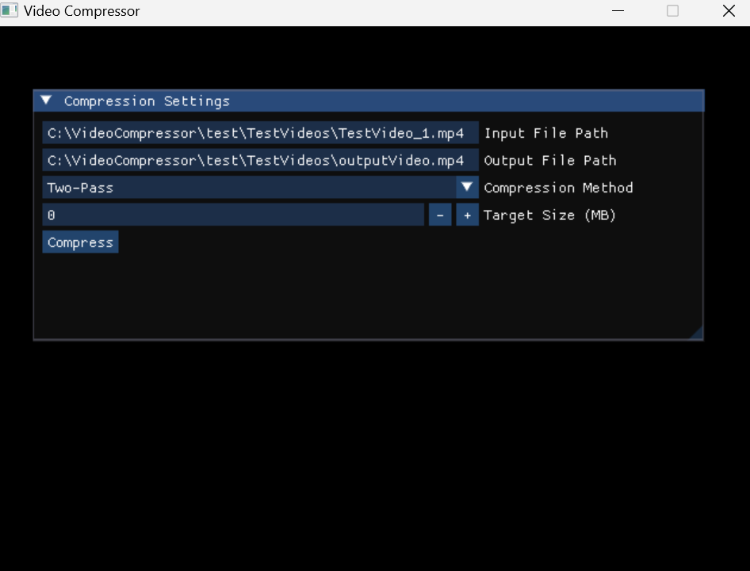

# Video Compressor

## Overview
Video Compressor is a tool designed to optimize the size of video files using advanced compression techniques while striving to maintain the original quality. The project integrates FFmpeg for robust video processing capabilities, SDL2 for graphical output, and Dear ImGui for creating an intuitive graphical user interface.

## Dependencies
- **FFmpeg 1.0**: Handles video processing tasks.
- **SDL2**: Used for rendering graphical components.
- **Dear ImGui**: Provides the graphical user interface.
These libraries are expected to be installed in the `/c/` directory of your system.

## Installation

### Prerequisites
Before compiling the project, ensure the following components are installed and located in the `/c/` directory:
- FFmpeg 1.0
- SDL2
- Dear ImGui

### Compiling the Project
To compile the project, follow these steps in MSYS or MinGW64 terminal:
1. Navigate to the project directory.
2. Execute the makefile with the command:
   ```bash
   make

### Running the Program

Once the project is compiled, you can run the program using the following command format:
    ```bash
    ./build/VideoCompressor
This will launch the GUI where the input/output path will be set plus the compression method and target size can also be set by the user.

## Interface Overview
The GUI provides several interactive elements to configure compression settings:

- **Input File Path**: Field where you input the path of the video file you want to compress. Click in the field to type the path or use a file dialog to select a file.
- **Output File Path**: Field to specify the path where the compressed video will be saved. Defaults to the same location as the input file with a modified name indicating compression.
- **Compression Method**: Dropdown menu to select the compression method. Currently supports only 'Two-Pass' method.

- **Target Size (MB)**: Numeric field to enter the desired file size of the compressed video. IF not possible to compress for the desired file size, an error will be raised by the ffmpeg lib.

Below is a screenshot of the GUI:



### Compressing a Video
After configuring the settings:

1. Click the **Compress** button to start the compression process.
2. Progress will be displayed within the GUI.
3. Upon completion, a message will indicate the success or failure of the operation.
